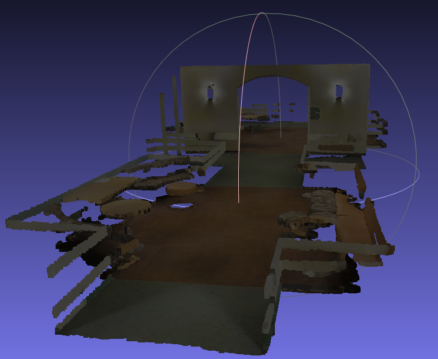

# TP RANSAC
_Author : Benjamin Ternot_

## Question 1
__What does the prominent plane represent in the cloud? How many points
does it count?__
>The prominent plane represents the floor in the cloud of the indoor environment.
> 
>After running RANSAC several times, I found that it counts about 135 000 points.

## Question 2
__How many tries do you need to get 99% chance of finding this plane.__
> To calculate the number of iterations required to have a 99% chance of finding the prominent plane, we use the following formula:
> $$k_{\text{min}} = \dfrac{\log\left(1 - p\right)}{\log\left(1 - \left(\dfrac{n}{N}\right)^3\right)}$$
> Where:  
> * $p$ is the probability of finding the plane.
> * $n$ is the number of points in the plane (here $\sim$ 135 000).
> * $N$ is the total number of points in the point cloud (here 412 756).
>
> By plugging in the values, we get $k_{\text{min}} \approx 130$ iterations.

## Question 3
__Question 3: Show a screenshot of the extracted planes. Are you satisfied with the
extraction? Explain what produces this behaviour.__
> The extracted planes are shown in the following image:
> 
> 

> 
> We can see that the prominent plane, with some other planes such as some walls or objects are extracted.
> 
> However, I am not completely satisfied with the extraction because I would have thought that more walls would have been extracted.
> I believe this is due to the fact that walls might not be very dense and that some objects are well more detailed than them, causing the algorithm to prefer them.